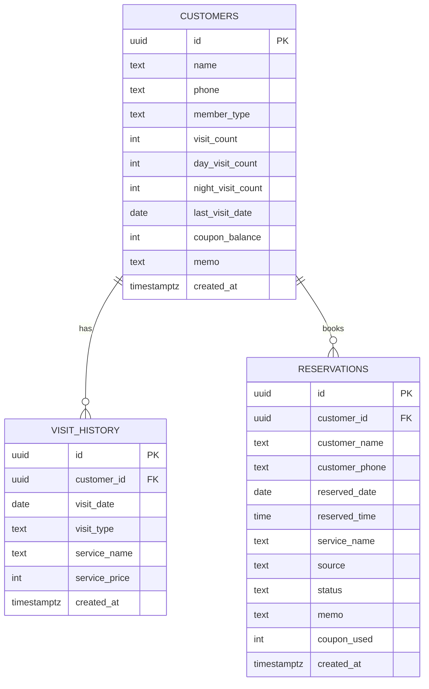
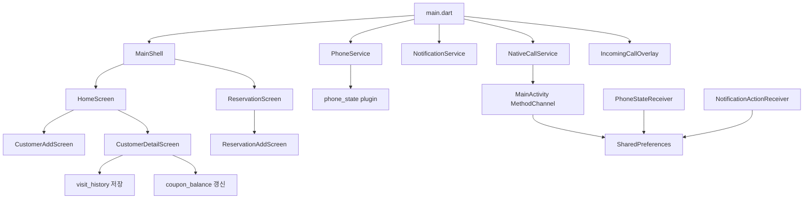
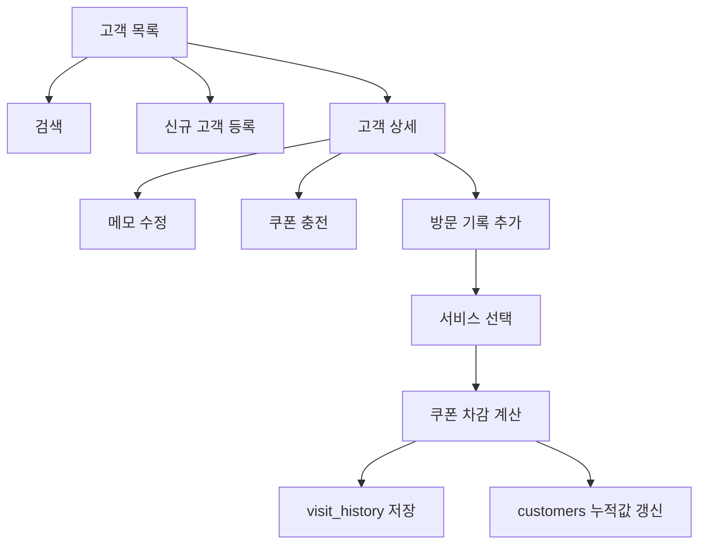
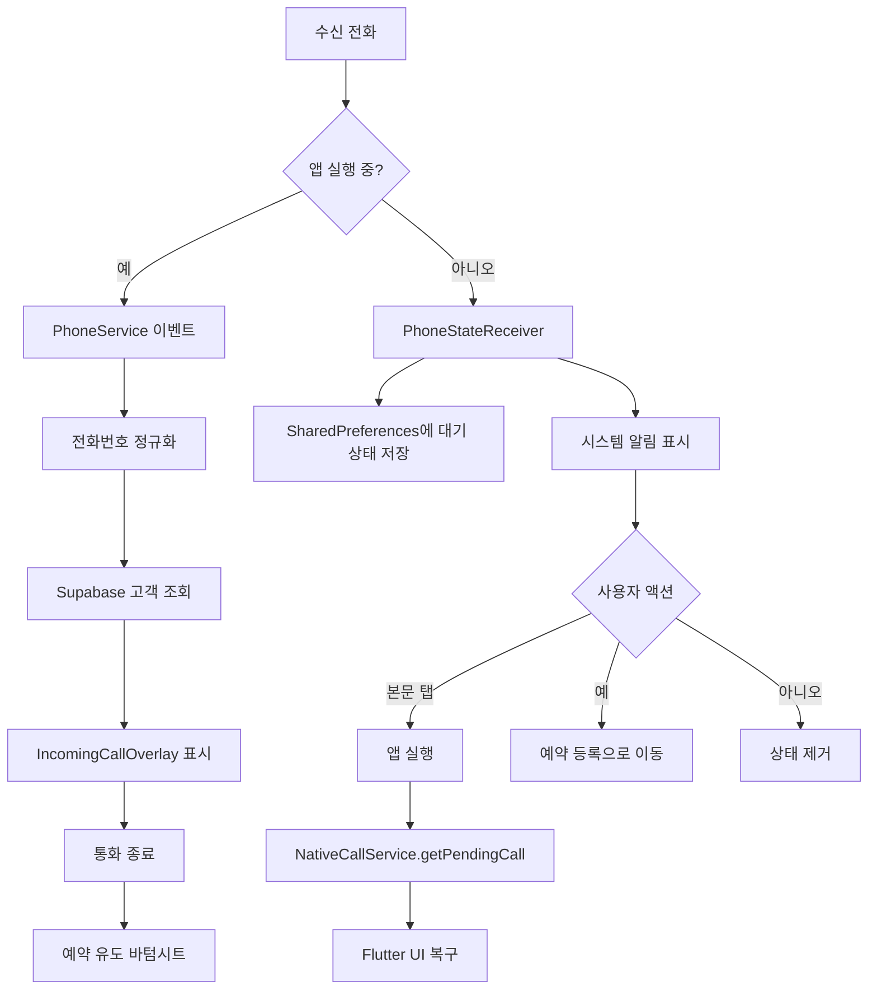
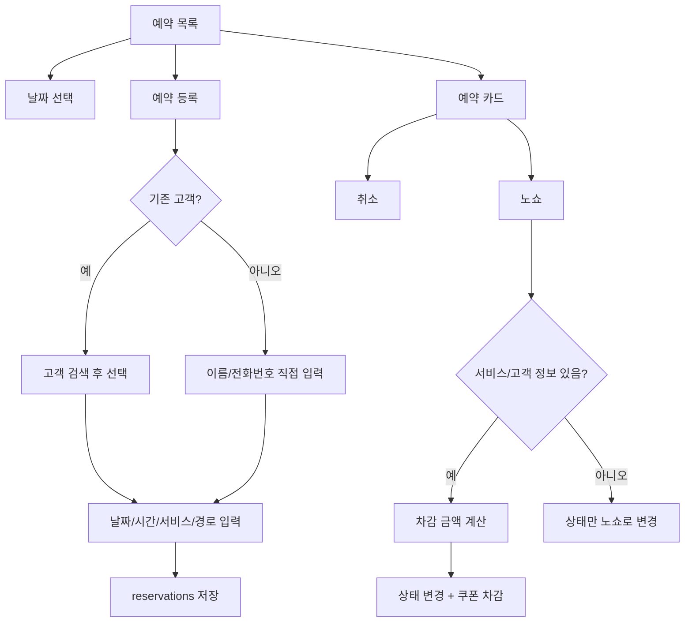

# 구조도 및 흐름도

## ERD

```mermaid
erDiagram
    CUSTOMERS ||--o{ VISIT_HISTORY : has
    CUSTOMERS ||--o{ RESERVATIONS : books

    CUSTOMERS {
        uuid id PK
        text name
        text phone
        text member_type
        int visit_count
        int day_visit_count
        int night_visit_count
        date last_visit_date
        int coupon_balance
        text memo
        timestamptz created_at
    }

    VISIT_HISTORY {
        uuid id PK
        uuid customer_id FK
        date visit_date
        text visit_type
        text service_name
        int service_price
        timestamptz created_at
    }

    RESERVATIONS {
        uuid id PK
        uuid customer_id FK
        text customer_name
        text customer_phone
        date reserved_date
        time reserved_time
        text service_name
        text source
        text status
        text memo
        int coupon_used
        timestamptz created_at
    }
```

## 앱 구성

```mermaid
flowchart TD
    A[main.dart] --> B[MainShell]
    B --> C[HomeScreen]
    B --> D[ReservationScreen]

    C --> E[CustomerAddScreen]
    C --> F[CustomerDetailScreen]
    F --> G[visit_history 저장]
    F --> H[coupon_balance 갱신]

    D --> I[ReservationAddScreen]

    A --> J[PhoneService]
    A --> K[NotificationService]
    A --> L[NativeCallService]
    A --> M[IncomingCallOverlay]

    J --> N[phone_state plugin]
    L --> O[MainActivity MethodChannel]
    O --> P[SharedPreferences]
    Q[PhoneStateReceiver] --> P
    R[NotificationActionReceiver] --> P
```

## 고객 화면 흐름

```mermaid
flowchart TD
    A[고객 목록] --> B[검색]
    A --> C[신규 고객 등록]
    A --> D[고객 상세]
    D --> E[메모 수정]
    D --> F[쿠폰 충전]
    D --> G[방문 기록 추가]
    G --> H[서비스 선택]
    H --> I[쿠폰 차감 계산]
    I --> J[visit_history 저장]
    I --> K[customers 누적값 갱신]
```

## 전화 수신 흐름

```mermaid
flowchart TD
    A[수신 전화] --> B{앱 실행 중?}
    B -->|예| C[PhoneService 이벤트]
    C --> D[전화번호 정규화]
    D --> E[Supabase 고객 조회]
    E --> F[IncomingCallOverlay 표시]
    F --> G[통화 종료]
    G --> H[예약 유도 바텀시트]

    B -->|아니오| I[PhoneStateReceiver]
    I --> J[SharedPreferences에 대기 상태 저장]
    I --> K[시스템 알림 표시]
    K --> L{사용자 액션}
    L -->|본문 탭| M[앱 실행]
    L -->|예| N[예약 등록으로 이동]
    L -->|아니오| O[상태 제거]
    M --> P[NativeCallService.getPendingCall]
    P --> Q[Flutter UI 복구]
```

## 예약 흐름

```mermaid
flowchart TD
    A[예약 목록] --> B[날짜 선택]
    A --> C[예약 등록]
    C --> D{기존 고객?}
    D -->|예| E[고객 검색 후 선택]
    D -->|아니오| F[이름/전화번호 직접 입력]
    E --> G[날짜/시간/서비스/경로 입력]
    F --> G
    G --> H[reservations 저장]

    A --> I[예약 카드]
    I --> J[취소]
    I --> K[노쇼]
    K --> L{서비스/고객 정보 있음?}
    L -->|예| M[차감 금액 계산]
    M --> N[상태 변경 + 쿠폰 차감]
    L -->|아니오| O[상태만 노쇼로 변경]
```
